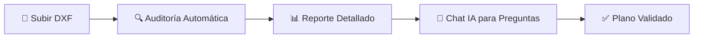

<div align="center">

# 🏗️ SIGEBIM

### Sistema Inteligente de Gestión y Auditoría BIM

**Valida tus planos CAD/BIM automáticamente con Inteligencia Artificial**

[](https://nextjs.org/)
[](https://python.org/)
[](https://supabase.com/)
[](https://ai.google.dev/)

[Demo](#demo) • [Características](#-características) • [Instalación](#-instalación-rápida) • [Documentación](#-documentación)

</div>

---

## 🎯 El Problema

Las empresas de construcción pierden **miles de dólares** en reprocesos por errores en planos CAD que se detectan tarde:

- ❌ Capas mal nombradas que confunden al equipo
- ❌ Colores no estándar que causan errores de interpretación
- ❌ Planos que no cumplen normativas (E.060, NTP, etc.)
- ❌ Horas de revisión manual que podrían automatizarse

## ✅ La Solución: SIGEBIM

**SIGEBIM** es una plataforma SaaS que **audita automáticamente** tus archivos DXF/IFC contra estándares de construcción, usando **Inteligencia Artificial**.

### Flujo de Trabajo



---

## 🚀 Características

### 🔍 Auditoría Automática de Planos
| Validación | Descripción |
|------------|-------------|
| **Capas** | Verifica nombres, colores y tipos de línea |
| **Entidades** | Cuenta líneas, círculos, bloques, textos |
| **Normativas** | Valida contra E.060, E.030, ACI 318 |
| **Score** | Puntuación de cumplimiento 0-100 |

### 🤖 Asistente IA Especializado
Pregúntale a la IA sobre tu plano:
- *"¿Cuántas capas tiene este archivo?"*
- *"¿Esta capa cumple con la norma E.060?"*
- *"¿Qué color debería tener la capa Muros?"*

> 🔒 **Restricción inteligente**: El asistente SOLO responde preguntas sobre CAD/BIM/construcción.

### ☁️ Almacenamiento Ilimitado
- Cloudflare R2 con **10GB gratis**
- **$0 en costos de descarga**
- Acceso global con CDN

### 🔐 Seguridad Empresarial
- Autenticación con Supabase Auth
- Row Level Security (RLS) en base de datos
- Organizaciones y roles de usuario

---

## 📸 Screenshots

<div align="center">

| Dashboard | Auditoría | Chat IA |
|-----------|-----------|---------|
|  |  |  |

</div>

---

## 🛠️ Tech Stack

| Componente | Tecnología |
|------------|------------|
| **Frontend** | Next.js 15, TypeScript, Tailwind CSS, shadcn/ui |
| **Backend** | Python FastAPI, ezdxf, boto3 |
| **Base de Datos** | Supabase PostgreSQL |
| **Almacenamiento** | Cloudflare R2 (S3-compatible) |
| **IA** | Google Gemini 1.5 Flash |
| **Infraestructura** | Docker, Docker Compose |

---

## ⚡ Instalación Rápida

### Prerrequisitos
- Docker & Docker Compose
- Cuenta de [Supabase](https://supabase.com) (gratis)
- API Key de [Google AI Studio](https://aistudio.google.com) (gratis)
- Bucket en [Cloudflare R2](https://dash.cloudflare.com) (gratis)

### 1. Clonar el repositorio
```bash
git clone https://github.com/Mikisbell/SIGEBIM.git
cd SIGEBIM
```

### 2. Configurar variables de entorno
```bash
cp .env.example .env
# Editar .env con tus credenciales
```

### 3. Iniciar el entorno de desarrollo
```bash
make dev
```

### 4. Abrir la aplicación
- **Frontend**: http://localhost:3005
- **Backend API**: http://localhost:8005

---

## 📁 Estructura del Proyecto

```
SIGEBIM/
├── frontend/               # Next.js 15 App
│   ├── src/
│   │   ├── app/            # App Router
│   │   ├── components/     # UI Components
│   │   └── lib/            # Utilities
│   └── Dockerfile.dev
├── backend/                # Python FastAPI
│   ├── core/
│   │   ├── audit_engine.py # DXF Processing
│   │   ├── gemini_service.py # AI Chat
│   │   └── r2_storage.py   # Cloudflare R2
│   └── Dockerfile
├── supabase/
│   └── migrations/         # Database Schema
├── docker-compose.yml
├── Makefile                # Development Commands
└── README.md
```

---

## 🔧 Comandos de Desarrollo

```bash
make dev        # Iniciar servicios
make stop       # Detener servicios
make restart    # Reconstruir y reiniciar
make logs       # Ver logs en tiempo real
make db-push    # Aplicar migraciones
```

---

## 💰 Modelo de Negocio

| Plan | Precio | Incluye |
|------|--------|---------|
| **Free** | $0/mes | 10 proyectos, 50MB storage |
| **Pro** | $29/mes | Proyectos ilimitados, 5GB storage, API access |
| **Enterprise** | Contactar | Multi-organización, SSO, soporte dedicado |

---

## 🗺️ Roadmap 2025-2026

- [x] ✅ Auditoría DXF básica
- [x] ✅ Chat IA con Gemini
- [x] ✅ Almacenamiento R2
- [ ] 🔄 Soporte IFC (BIM completo)
- [ ] 🔄 Detección de choques (Clash Detection)
- [ ] 🔄 Integración Revit/AutoCAD plugins
- [ ] 🔄 OCR para planos escaneados
- [ ] 🔄 Reportes PDF automatizados

---

## 🤝 Contribuir

¿Quieres contribuir? ¡Genial!

1. Fork el repositorio
2. Crea una rama: `git checkout -b feature/nueva-caracteristica`
3. Commit: `git commit -m 'Agregar nueva característica'`
4. Push: `git push origin feature/nueva-caracteristica`
5. Abre un Pull Request

---

## 📄 Licencia

Este proyecto está bajo la licencia **MIT**. Ver [LICENSE](LICENSE) para más detalles.

---

## 📞 Contacto

**Grupo Rivamez** - Transformando la construcción con tecnología

- 📧 Email: gruporivamez@gmail.com
- 🌐 Web: [www.sigebim.com](https://www.sigebim.com)
- 💼 LinkedIn: [Grupo Rivamez](https://linkedin.com/company/gruporivamez)

---

<div align="center">

**⭐ Si te gusta SIGEBIM, dale una estrella al repo ⭐**

Hecho con ❤️ en Perú 🇵🇪

</div>
